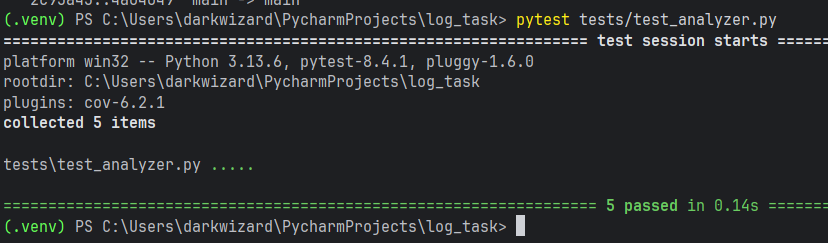

# Анализатор log-файлов

Данный скрипт предназначен для сбора информации и формирования отчета о log-файлах

## Как запустить
В терминале PyCharm ввести команду для:

* одного файла ввести
python log_analyzer/app.py --file example1.log --report average

* для двух и более файлов ввести
python log_analyzer/app.py --file example1.log --report average --file example2.log --report average

* с фильтром по дате
python log_analyzer/app.py --file example1.log --report average --file example2.log --report average --date 2025-06-22

### Пример вывода

## Вызов pytest
* pytest tests/test_analyzer.py

###
Проект проектирован, чтоб не падать при ошибках (несуществующий файл или неверная дата)
Основная логика сосредоточена в функции process_files, покрыта тестами, включая проверку обработки ошибок